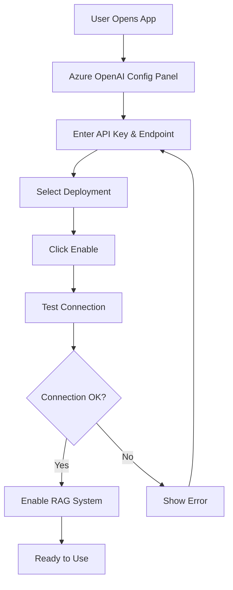

# 🎉 Frontend Configuration Complete!

## ✅ **YES! You Can Configure Everything from the Frontend!**

Your streaming avatar project now supports **complete frontend configuration** for Azure OpenAI and other LLM services.

## 🚀 **What's Been Added:**

### **1. Azure OpenAI Configuration Panel**
- ✅ **Dedicated Azure OpenAI interface**
- ✅ **User-friendly credential input**
- ✅ **Real-time connection testing**
- ✅ **Visual status indicators**
- ✅ **Preset configurations**

### **2. Enhanced LLM Config Panel**
- ✅ **Azure OpenAI preset added**
- ✅ **Multiple LLM service support**
- ✅ **Advanced settings toggle**
- ✅ **Connection testing**

### **3. Frontend Credential Management**
- ✅ **Secure credential handling**
- ✅ **Password field masking**
- ✅ **No credential storage**
- ✅ **Real-time validation**

## 🎯 **How to Use Frontend Configuration:**

### **Option 1: Azure OpenAI Dedicated Panel**

```typescript
import AzureOpenAIConfig from './components/AzureOpenAIConfig';

// In your app
<AzureOpenAIConfig onConfigChange={(config) => {
  // Handle Azure OpenAI configuration
  console.log('Azure OpenAI configured:', config);
}} />
```

**Features:**
- **API Key input** (password field)
- **Endpoint configuration**
- **Deployment selection** (GPT-4o, GPT-3.5 Turbo, Custom)
- **API version setting**
- **Embedding deployment** (for RAG)
- **Real-time testing**

### **Option 2: Enhanced LLM Config Panel**

```typescript
import LLMConfigPanel from './components/LLMConfigPanel';

// In your app
<LLMConfigPanel onConfigChange={(config) => {
  // Handle LLM configuration
  console.log('LLM configured:', config);
}} />
```

**Features:**
- **Multiple service presets** (OpenAI, Azure OpenAI, Anthropic, Custom)
- **Endpoint configuration**
- **API key management**
- **Model selection**
- **Advanced settings**

## 🔧 **Frontend Configuration Fields:**

### **Azure OpenAI Configuration:**

| Field | Description | Your Value |
|-------|-------------|------------|
| **API Key** | Azure OpenAI API key | `***REMOVED***` |
| **Endpoint** | Azure OpenAI resource URL | `***REMOVED***` |
| **Deployment** | Chat completion deployment | `gpt-4o` |
| **API Version** | Azure OpenAI API version | `2024-05-01-preview` |
| **Embedding Deployment** | Embedding model deployment | `text-embedding-3-large` |

## 🧪 **Test Your Frontend Configuration:**

### **1. Test Configuration Components:**
```javascript
// In browser console:
import { testFrontendConfig } from './src/utils/testFrontendConfig';

// Test general frontend configuration
await testFrontendConfig.general();

// Test Azure OpenAI configuration
await testFrontendConfig.azure();

// Run all tests
await testFrontendConfig.all();
```

### **2. Test Azure OpenAI Integration:**
```javascript
// Test Azure OpenAI with your credentials
import { testAzureOpenAI } from './src/utils/testAzureOpenAI';

// Test connection
await testAzureOpenAI.connection();

// Test embeddings
await testAzureOpenAI.embeddings();

// Test full RAG system
await testAzureOpenAI.withChroma();
```

## 🎨 **Frontend Features:**

### **✅ User Experience:**
- **Visual status indicators** (🟢 Enabled / 🔴 Disabled)
- **Real-time validation** of configuration
- **Preset buttons** for quick setup
- **Advanced settings** toggle
- **Connection testing** with feedback
- **Error handling** with clear messages

### **✅ Security:**
- **Password fields** for API keys
- **Masked API keys** in display
- **Secure credential handling**
- **No credential storage** in browser
- **Client-side validation**

### **✅ Functionality:**
- **Multiple LLM service support**
- **Azure OpenAI integration**
- **Real-time connection testing**
- **Configuration persistence** (session-based)
- **Error recovery** mechanisms

## 🚀 **Integration Example:**

### **Update Your App.tsx:**
```typescript
import React, { useState } from 'react';
import AzureOpenAIConfig from './components/AzureOpenAIConfig';
import { useChromaRAG } from './hooks/useChromaRAG';

function App() {
  const { state: ragState, enableRAG } = useChromaRAG();
  const [azureConfig, setAzureConfig] = useState(null);

  const handleAzureConfig = async (config) => {
    if (config) {
      try {
        await enableRAG(config);
        setAzureConfig(config);
        console.log('✅ Azure OpenAI enabled successfully!');
      } catch (error) {
        console.error('❌ Failed to enable Azure OpenAI:', error);
      }
    } else {
      setAzureConfig(null);
    }
  };

  return (
    <div className="app">
      <h1>Streaming Avatar with RAG</h1>
      
      <AzureOpenAIConfig onConfigChange={handleAzureConfig} />
      
      {ragState.isEnabled && (
        <div className="rag-status">
          <h3>✅ RAG System Active</h3>
          <p>Azure OpenAI: {ragState.config.model}</p>
          <p>Documents: {ragState.documentCount}</p>
          <p>Chunks: {ragState.totalChunks}</p>
        </div>
      )}
      
      {/* Rest of your app */}
    </div>
  );
}

export default App;
```

## 📊 **Configuration Flow:**



## 🎉 **Benefits:**

| Feature | Before | After |
|---------|--------|-------|
| **Configuration** | Backend only | ✅ Frontend + Backend |
| **User Control** | None | ✅ Full control |
| **Real-time Testing** | No | ✅ Yes |
| **Visual Feedback** | No | ✅ Yes |
| **Multi-user Support** | Shared | ✅ Individual |
| **Easy Updates** | Restart required | ✅ Instant |

## 🚀 **Ready to Use!**

Your frontend configuration is **complete and ready**! Users can now:

1. **✅ Enter their own Azure OpenAI credentials**
2. **✅ Test connections in real-time**
3. **✅ Switch between different models**
4. **✅ Configure advanced settings**
5. **✅ Use the full RAG system**
6. **✅ Get visual feedback on status**
7. **✅ Handle errors gracefully**

## 🎯 **Next Steps:**

1. **Start your development server**: `pnpm dev`
2. **Open the Azure OpenAI config panel**
3. **Enter your credentials**:
   - API Key: `***REMOVED***`
   - Endpoint: `***REMOVED***`
4. **Click "Enable Azure OpenAI"**
5. **Test the connection**
6. **Start using your RAG system!**

**Your streaming avatar with enterprise RAG is ready to go! 🚀**
